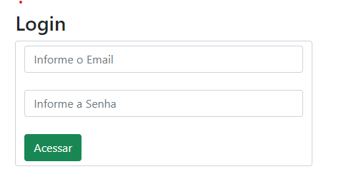

# nesse repositotio foi criado dois sites um para verificar seu seu CPF e outro para cadastrar seu gmail.


## site para verificar seu cpf:


  


nesse site foi usado tecmologias como HTML

 ``` 
<!DOCTYPE html>
<html>

<head>
    <meta charset='utf-8'>
    <meta http-equiv='X-UA-Compatible' content='IE=edge'>
    <title></title>
    <meta name='viewport' content='width=device-width, initial-scale=1'>
    <link rel='stylesheet' type='text/css' media='screen' href='cpf.css'>

</head>

<body>
    <div class="container">
        <form action="" id="cpfForm" class="form">
            <h1>Validação de CPF</h1>
            <label for="email">Digite seu CPF</label>
            <input type="text" id="cpf" name="cpf" maxlength="14">
            <button type="submit">Validar</button>
            <p id="message"></p>
        </form>

    </div>
    <script src='cpf.js'></script>

</body>

</html>

 ```

  O codigo do HTML não foi feita muita coisa já que a maioria do codigo foi criado com javaScript, o html foi usado para poder dar corpo ao site.

  outro elemento usado no codigo e javaScript

   ``` 
   // VALIDAÇÃO DE CPF
// Adiciona escutador á página
// ------------------------------------------------------------------------------------------------------------

document.getElementById("cpfForm").addEventListener('submit', function (event) {
    event.preventDefault();

    const cpf = document.getElementById('cpf').value;
    const msg = document.getElementById('message');
    // mostrar mensagem
    // ------------------------------------------------------------------------------------------------------------
    if (validarCPF(cpf)) {
        msg.textContent = "O CPF é valido!";
        msg.style.color = 'green';
    } else {
        msg.textContent = "O CPF e invalido!";
        msg.style.color = 'red';

    }


}


);
// função de calculo de validação do CPF
// ----------------------------------------------------------------------------------------------------------
function validarCPF(cpf) {
    cpf = cpf.replace(/[^\d]+/g, ''); //remove caracteres não numérico

    // verificar se o valor contem 11 digitos e se todos os dígitos ão iguais
    // --------------------------------------------------------------------------------------------------------
    if (cpf.length !== 11 || /^(\d)\1{10}$/.test(cpf)) {
        return false;
    }
    let soma = 0;
    let resto = 0;
    //  VALIDAÇÃO DO PRIMEIRO DIGITO VERIFICADOR 
    // ------------------------------------------------------------------------------------------------------------
    for (let i = 1; i <= 9; i++) {
        soma += parseInt(cpf.substring(i - 1, i)) * (11 - i);
    }

    resto = (soma * 10) % 11;
    if ((resto === 10) || (resto === 11)) {
        resto = 0;

    }
    if (resto !== parseInt(cpf.substring(9, 10))) {
        return false;
    }
    soma = 0

    // Validar 11 díguito do CPF 2° díguito verificado
    // ---------------------------------------------------------------------------------------------------------
    for (let i = i; i <= 10; i++) {
        soma += parseInt(cpf.substring(i - 1, i)) * (12 - i);
    }

    soma = (soma * 10) % 11;
    if ((resto === 10) || (resto === 11)) {
        resto = 0

    }
    if (resto !== parseInt(cpf.substring(10, 11))) {
        return false;
    }

    return true;

o codigo do cpf no javaSescript realiza a função de verificar se seu cpf e valido e se o cpf n for valido ele mostrara uma mensagem endi sera informado " CPF invalido ".
}
   ```
   

##  esse site e para cadastrar seu G-mail


   


   Em este codogo tambem não foi utilizado muito o HTML já que a maioria do codigo foi feito no javaScript, send

  
   ```
   <!DOCTYPE html>
<html>
  <head>
    <meta charset="utf-8" />
    <meta http-equiv="X-UA-Compatible" content="IE=edge" />
    <title>Login-Cad</title>
    <meta name="viewport" content="width=device-width, initial-scale=1" />
    <link rel="stylesheet" type="text/css" media="screen" href="login.css" />
    <link
      href="https://cdn.jsdelivr.net/npm/bootstrap@5.0.2/dist/css/bootstrap.min.css"
      rel="stylesheet"
      integrity="sha384-EVSTQN3/azprG1Anm3QDgpJLIm9Nao0Yz1ztcQTwFspd3yD65VohhpuuCOmLASjC"
      crossorigin="anonymous"
    />
  </head>
  <body>
    <div class="container col-4">
      <h3>Login</h3>
      <form action="" class="form-control">
        <input type="text" name="" id="loginEmail" class="form-control" placeholder="Informe o Email"/><br />
        <input type="password" id="loginSenha" class="form-control" placeholder="Informe a Senha" />
        <br />
        <button class="btn btn-success" type="button" onclick="acessar()">Acessar</button>
      </form>
    </div>
 
    <script src="control.js"></script>
  </body>
</html>

   
   ``` 
### Codigo do javaScript

   ``` 
function acessar(){
    let loginEmail = document.getElementById('loginEmail').value;
    let loginSenha = document.getElementById('loginSenha').value;
 
       if(!loginEmail || !loginSenha){
          alert('favor preencher todos os campos');
 
       }else{
        // else{ alert('campos preenchisdos com sucesso'); }
        window.location.hrefc = 'cadastro.html'
       }
 }
 
 // FUNÇÃO PARA ARMAZENAMENTO DE NOMES EM ARRAY
 //------------------------------------------------------------------------------------------------------------------------
 var dadosLista = [];
 function salvarUser(){
    let nomeUser = document.getElementById('nomeUser').value;
 
    if(nomeUser){
       dadosLista.push(nomeUser);
       console.log(dadosLista);
 
    }else{
       alert('porfavor iforme um nome para cadastro');
    }
 
 
 }
   ``` 
   o codigo do gmail no javaSescript realiza a função de verificar se seu gmail e valido e se o gamil não for valido ele mostrara uma mensagem endi sera informado " diguite um gmail valido porfavor ".
